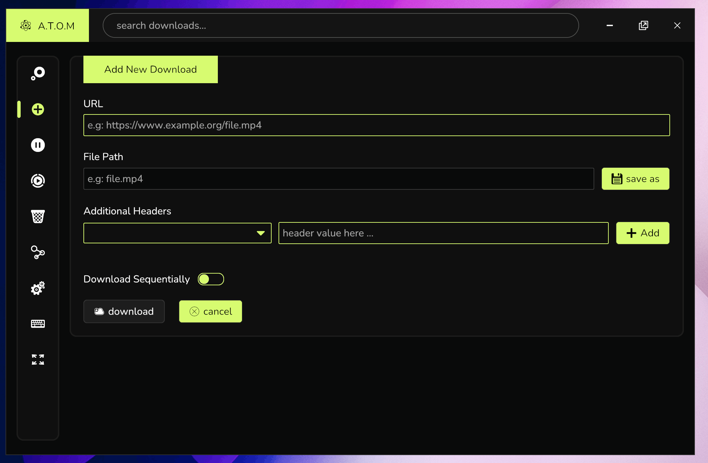

<div style="text-align: center">

# ATOM Download Manager

ATOM is a modern looking download manager written in Rust using [Iced](https://github.com/iced-rs/iced) GUI library.

<!--  -->



</div>

## Features

-   Offers a clean and user-friendly interface.
-   Supports multiple connections.
-   Pause/Resume support.
-   Import downloads from file.
-   Captures download from browser.
-   Multiple themes.

<!-- ## Download -->
<!-- Prebuilt binaries for macOS and Windows can be downloaded from [GitHub Releases](https://github.com/yourusername/atom-download-manager). -->

## Build

For building on Linux you need to install these dependencies first:

```bash
sudo apt install pkg-config libglib2.0-dev libpango1.0-dev libgtk-3-dev libssl-dev libxdo-dev
```

To build ATOM Download Manager from source, follow these steps:

1. Clone the repository.

```
git clone https://github.com/tarunzoot/atom.git
```

2. Build and run the application:

```
cd atom
cargo r --release
```

## Browser Extension Installation

-   **For Chrome/Edge/Brave**: [Link](https://support.google.com/chrome/a/answer/2714278?hl=en) (Check step 2)
-   **For Firefox**: [Link](https://developer.mozilla.org/en-US/docs/Mozilla/Add-ons/WebExtensions/Your_first_WebExtension#installing)

## Limitations

Atom is tested and used on Windows only. Atom may or may not work as intended on Linux or macOS.

## Contributing

Contributions are greatly appreciated! Being a newbie at Rust and Iced, I would very highly value your suggestions and feedback.

<!-- Happy downloading with ATOM Download Manager!
7f5da1e901cfffc26e57bbb987329be0d72fa39f6dadd9a44f985cd05e26da133eef3f8653f3df178c2cbb954a9e5a77d0a17756ac88f62cfcc660b184ca10ea
-->
